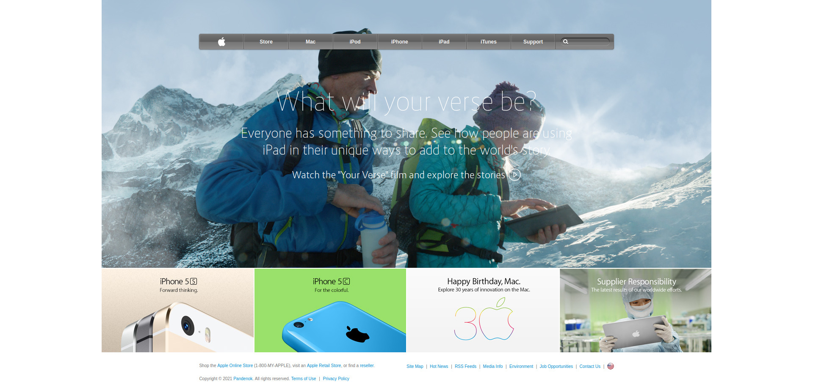

<!-- PROJECT LOGO -->

# Project: Apple 2014 Homepage

## What's this

This is a clone of the [archived Apple homepage](https://web.archive.org/web/20140301004610/http://www.apple.com/) from 2014, created as part of the [HTML and CSS](https://www.theodinproject.com/courses/html-and-css) course at [The Odin Project](https://www.theodinproject.com/). The main goal of the assignment is to master the concepts of using images as background and adding gradients to elements. It shows up positioning skills (Flexbox, Grid, Floats) as well. The full assignment can be found [here](https://www.theodinproject.com/courses/html-and-css/lessons/building-with-backgrounds-and-gradients).

## Live Demo

Check the [live demo](https://pandenok.github.io/apple-old-webpage/)  
  
 -- or --    

  
Click to see screenshots

  

    
  

  

## Built With

- HTML
- CSS

## Reflection

- All the main elements (including navbar) are built using grid.
- The main challenge was to create a nested link, as far as the browsers don't support it. I used [this](https://bdwm.be/html5-alternative-nested-anchor-tags/) CSS method found in a [SO](https://stackoverflow.com/questions/13052598/creating-anchor-tag-inside-anchor-tag) discussion. You can see the demo of the technique on [Codepen](https://codepen.io/pwkip/pen/oGMZjb). There is also a good overview of all possible solutions on [CSS-Tricks](https://css-tricks.com/nested-links/)
- To create lightening effect on nav buttons `inner shadow` was applied.
- In order to avoid creating vertical dividers on horizontal UL menu in HTML manually I applied an `:after` pseudo-class.
- **Fun fact:** on original website in Mozilla Firefox the darker gradiend shows on top and in Google Chrome is on the bottom of the navbar :)

## Show your support

Give a :star: if you like this project!